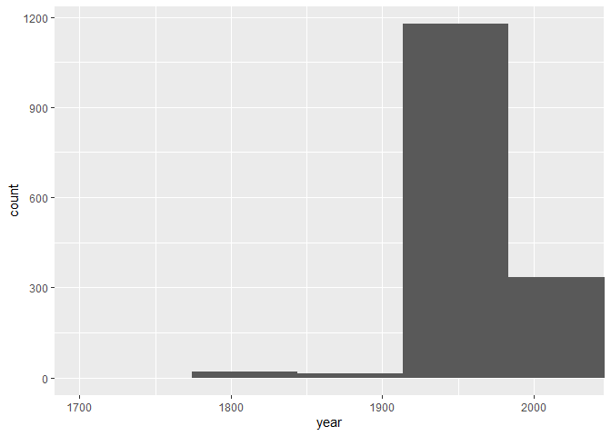
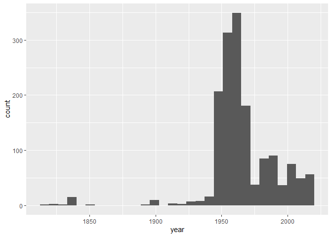

Lab 07 - University of Edinburgh Art Collection
================
Insert your name here
Insert date here

### Load packages and data

``` r
library(tidyverse) 
library(skimr)
```

    ## Warning: package 'skimr' was built under R version 4.1.3

``` r
library(stringr)
library(robotstxt)
```

``` r
# Remove eval = FALSE or set it to TRUE once data is ready to be loaded
uoe_art <- read_csv("data/uoe-art.csv")
```

### Exercise 9

``` r
uoe_art <- uoe_art %>%
  separate(title, into = c("title", "date"), sep = "\\(") %>%
  mutate(year = str_remove(date, "\\)") %>% as.numeric()) %>%
  select(title, artist, year, link)
```

    ## Warning: Expected 2 pieces. Additional pieces discarded in 36 rows [135, 168,
    ## 332, 422, 506, 521, 790, 800, 853, 900, 945, 958, 1090, 1134, 1166, 1226, 1287,
    ## 1346, 1433, 1485, ...].

    ## Warning: Expected 2 pieces. Missing pieces filled with `NA` in 620 rows [2,
    ## 19, 23, 36, 37, 51, 55, 60, 65, 74, 87, 94, 97, 98, 100, 101, 102, 103, 105,
    ## 107, ...].

    ## Warning in str_remove(date, "\\)") %>% as.numeric(): NAs introduced by coercion

### Exercise 11

``` r
skim(uoe_art)
```

|                                                  |         |
|:-------------------------------------------------|:--------|
| Name                                             | uoe_art |
| Number of rows                                   | 2910    |
| Number of columns                                | 4       |
| \_\_\_\_\_\_\_\_\_\_\_\_\_\_\_\_\_\_\_\_\_\_\_   |         |
| Column type frequency:                           |         |
| character                                        | 3       |
| numeric                                          | 1       |
| \_\_\_\_\_\_\_\_\_\_\_\_\_\_\_\_\_\_\_\_\_\_\_\_ |         |
| Group variables                                  | None    |

Data summary

**Variable type: character**

| skim_variable | n_missing | complete_rate | min | max | empty | n_unique | whitespace |
|:--------------|----------:|--------------:|----:|----:|------:|---------:|-----------:|
| title         |         1 |          1.00 |   0 |  95 |     8 |     1342 |          0 |
| artist        |       113 |          0.96 |   2 |  55 |     0 |     1103 |          0 |
| link          |         0 |          1.00 |  57 |  60 |     0 |     2910 |          0 |

**Variable type: numeric**

| skim_variable | n_missing | complete_rate |    mean |    sd |  p0 |  p25 |  p50 |  p75 | p100 | hist  |
|:--------------|----------:|--------------:|--------:|------:|----:|-----:|-----:|-----:|-----:|:------|
| year          |      1366 |          0.53 | 1964.52 | 56.05 |   2 | 1953 | 1962 | 1980 | 2020 | ▁▁▁▁▇ |

``` r
sum(is.na(uoe_art$artist))
```

    ## [1] 113

``` r
sum(is.na(uoe_art$title))
```

    ## [1] 1

``` r
sum(is.na(uoe_art$year))
```

    ## [1] 1366

``` r
sum(is.na(uoe_art$link))
```

    ## [1] 0

### Exercise 11,12

``` r
summary(uoe_art$year)
```

    ##    Min. 1st Qu.  Median    Mean 3rd Qu.    Max.    NA's 
    ##       2    1953    1962    1965    1980    2020    1366

``` r
## some weird thing is in there (2), but let's skip it 


ggplot(data = uoe_art, aes(x = year)) +
  geom_histogram()+
  coord_cartesian(xlim = c(1700, 2030))
```

    ## `stat_bin()` using `bins = 30`. Pick better value with `binwidth`.

    ## Warning: Removed 1366 rows containing non-finite values (stat_bin).

<!-- -->

## ex 13, 14 15

``` r
uoe_art %>%
  filter(year==2)%>%
  View()

uoe_art %>%
  filter(year==2)%>%
  View()


uoe_art$year<-ifelse(uoe_art$year==2,1964,uoe_art$year)

uoe_art$title[uoe_art$title=="Death Mask"] <- "Death Mask (2)"


ggplot(data = uoe_art, aes(x = year)) +
  geom_histogram()
```

    ## `stat_bin()` using `bins = 30`. Pick better value with `binwidth`.

    ## Warning: Removed 1366 rows containing non-finite values (stat_bin).

<!-- -->

``` r
uoe_art %>%
  count(artist) %>%
  arrange(desc(n))
```

    ## # A tibble: 1,104 x 2
    ##    artist               n
    ##    <chr>            <int>
    ##  1 Unknown            351
    ##  2 Emma Gillies       144
    ##  3 <NA>               113
    ##  4 John Bellany        20
    ##  5 Ann F Ward          19
    ##  6 Zygmunt Bukowski    17
    ##  7 Boris Bucan         16
    ##  8 Gordon Bryce        16
    ##  9 Marjorie Wallace    16
    ## 10 William Gillon      15
    ## # ... with 1,094 more rows

``` r
uoe_art %>% 
  filter(str_detect(title, fixed('child', ignore_case = TRUE))) 
```

    ## # A tibble: 10 x 4
    ##    title                                                      artist  year link 
    ##    <chr>                                                      <chr>  <dbl> <chr>
    ##  1 "Child's collar. Chinese"                                  Unkno~    NA http~
    ##  2 "Virgin and Child"                                         Unkno~    NA http~
    ##  3 "Untitled - Children Playing "                             Monik~  1963 http~
    ##  4 "The Children's Hour "                                     Eduar~    NA http~
    ##  5 "Virgin and Child "                                        Unkno~    NA http~
    ##  6 "Woman with Child and Still Life "                         Cathe~  1938 http~
    ##  7 "Child's chinese headdress"                                Unkno~    NA http~
    ##  8 "Virgin and Child "                                        Unkno~    NA http~
    ##  9 "Figure Composition with Nurse and Child, and Woman with ~ Edwar~    NA http~
    ## 10 "The Sun Dissolves while Man Looks Away from the Unborn C~ Eduar~    NA http~
